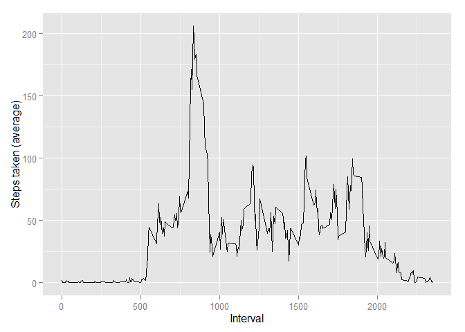

# Reproducible Research: Peer Assessment 1


## Loading and preprocessing the data

To start the analysis we have to load the data.

```r
table = read.csv("repdata-data-activity/activity.csv")
table[,2] = as.Date(table[,2]) ## making dates have date format
```
## What is mean total number of steps taken per day?
Let's start by taking histogram of total number of steps taken each day.

```r
library(dplyr) ## loading useful libraries
library(ggplot2)
table_grouped_day = group_by(table, date) ## grouping records by day
tot_days = summarise(table_grouped_day, sum = sum(steps, na.rm = TRUE))
qplot(tot_days$sum, geom = "histogram", title = "", xlab = "Total numbers of steps in a day", ylab = "")
```

 
 
  
The mean and median of steps taken per day are as follows:

```r
mean(tot_days$sum, na.rm = TRUE)
```

```
## [1] 9354.23
```

```r
median(tot_days$sum, na.rm = TRUE)
```

```
## [1] 10395
```

## What is the average daily activity pattern?

Next we'll measure how many steps were taken in different intervals averaged over all days.


```r
table_grouped_int = group_by(table, interval) ## grouping records by interval
avg_steps = summarise(table_grouped_int, avg = mean(steps, na.rm = TRUE))
qplot(x = interval, y = avg, data = avg_steps, xlab = "Interval", ylab =  "Steps taken (average)", geom = "line")
```

 
  
Now we can find the interval which on average has the maximum number of steps.

```r
avg_steps$interval[avg_steps$avg == max(avg_steps$avg)]
```

```
## [1] 835
```


## Imputing missing values

We'll start by calcualting number of records containing missing values.

```r
sum(is.na(table$steps))
```

```
## [1] 2304
```
  
This number constitutes over 13% of all the records and seems to be quite large. Let's try to fill this gaps by putting in the average by interval.

```r
table_NA_less = table
for (i in 1:length(table$steps)) 
    if (is.na(table$steps[i])) 
        table_NA_less$steps[i] <- as.numeric(avg_steps[avg_steps$interval == table_NA_less$interval[i], 2])
```
  
Now to check if we've gotten rid of all the missing values:

```r
sum(is.na(table_NA_less))
```

```
## [1] 0
```

We can make make histogram and calculate the mean and median of total number of steps
taken per day.

```r
table_NA_less_grouped_day = group_by(table_NA_less, date) ## grouping records by day
tot_days = summarise(table_NA_less_grouped_day, sum = sum(steps, na.rm = TRUE))
qplot(tot_days$sum, geom = "histogram", title = "", xlab = "Total numbers of steps in a day", ylab = "")
```

 

```r
mean(tot_days$sum, na.rm = TRUE)
```

```
## [1] 10766.19
```

```r
median(tot_days$sum, na.rm = TRUE)
```

```
## [1] 10766.19
```
  
As we can see, after imputing missing values, total number of steps distribution appears to be noticebly more Gaussian. It's further confirmed by mean and median being equal to each other.


## Are there differences in activity patterns between weekdays and weekends?
Let's examin the difference between activity patterns during week days and weekend.
First let's create another feature indicating wheter record was  was collected.

```r
Sys.setlocale("LC_TIME","English") ## setting weekdays names to english
```

```
## [1] "English_United States.1252"
```

```r
dt = as.character(lapply(table$date,           ## creating vector containg what we need
                         function(x) {
                           if (weekdays(x, abbreviate = TRUE) == "Sat" |
                               weekdays(x,   abbreviate = TRUE) == "Sun")
                                  return("weekend") 
                           else 
                                  return("weekday")
                           }))
table_week = mutate(table, daytype = as.factor(dt)) ## adding new  column
```
  
After this preparation now we're ready to make a plot showing the difference in activity patterns between weekdays and weekends.

```r
table_week_int = group_by(table_week, daytype, interval)
avg_steps = summarise(table_week_int, avg = mean(steps, na.rm = TRUE))
ggplot(avg_steps,  aes(interval, avg)) + geom_line() + facet_grid(daytype ~.) +
  labs(x = "Interval", y = "Steps taken (average)")
```

 
